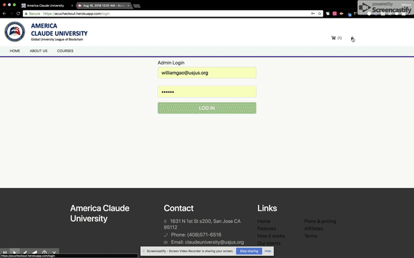

# Rich_Core_Checkout

A course category with block chain payment  

Deployed on Heroku.com 
https://acucheckout.herokuapp.com/
  
Technologies used: MongoDB | Express | React JS | Node JS | Cripto JS | RichCore Payment API | DotENV | Nodemailer | Dropzone |  Cloudinary Storage | Cookie-session | JavaScript | Material Design BootStrap | HTML5 | CSS3

* Course shopping and checkout 
* 

* Admin
* 

_Developer: Chunjin (William) Gao_
_Email: seewilliam.gao@gmail.com_

_Developer: Jinhua Zou_
_Email: 438455419@qq.com_
